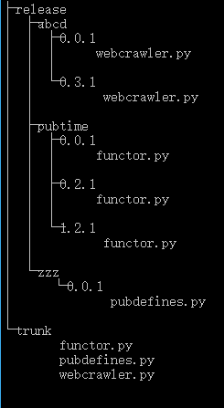
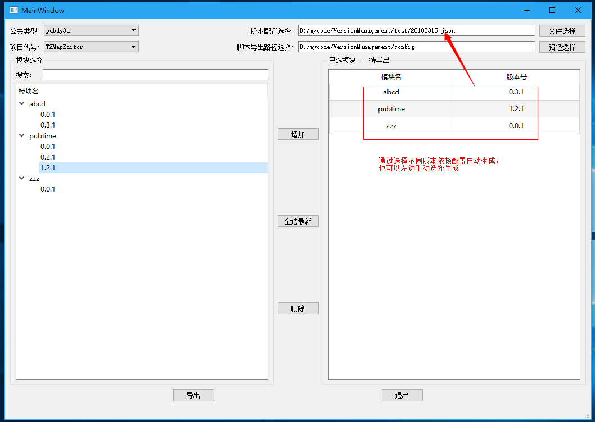

# 一、改为模块分版本管理原因	
当A业务和B业务员相互依赖时，如果A业务重构，那么为了兼容需要保留新旧两份A业务代码，并且B业务需要加入兼容代码，当有很多这种需要保留两份代码+大量的兼容代码存在时，就会出现以下几个问题：
1. 冗长的代码难以阅读
2. 复杂的兼容逻辑往往带来极高的不稳定性
3. 维护起来会很麻烦，而且容易错误

#  二、如何改动
1. 建立两个文件夹 __trunk__ 和 __release__
	- trunk：开发版本目录
	* release：包含所有版本的代码，可以根据需求选择不同的版本导出

		
		
2. 每个单文件以及包模块增加 __version__ 版本字段
3. 每次修改代码时同步修改版本字段，用工具生成各模块之间的版本依赖关联文件
4. 然后将新的代码保存到对应模块的新版本目录下。

#  三、如何使用 
- 使用 __VersionManagement__ 工具。

1. 根据界面提示选择对应的数据
2. 选择（二.3）中的关联文件即可生成你需要的版本
3. 点击导出即可
4. 如果你想自定义选择默写模块版本可以重左边模块树中选择
