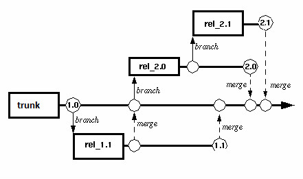
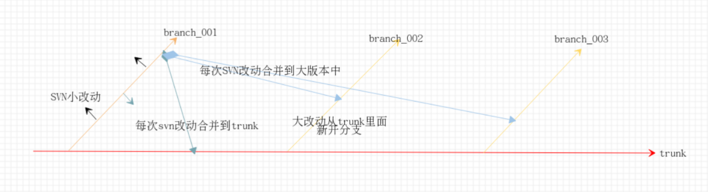

# 初始版本
所有编辑器共用一份内建svn的公共代码
## 问题：
- 每次都是新加模块、新加功能、兼容性的修改，代码结构很混乱不利于使用
- 更别想着代码的迭代开发，开发大量的改动，无法满足所有编辑器同步公共代码的开发改动同步提交。
## 解决：
- 每个模块分版本管理，有迭代开发提高版本号，编辑器使用版本工具选择自己所需的版本。

# 第一版本
模块分版本管理
## 问题：
- 每次导出代码时都要选择模块名+版本名很麻烦，也很容易出错
- 而且编辑器不应该关心这些模块版本之间的关联
## 解决：
- 去掉模块名选择，每次改动代码生成当前改动依赖的模块版本配置文件
- 只需要选择对应改动的配置文件就可以直接导出

# 第二版本
模块分版本管理，用户无需关心模块之间的关联
模块版本配置可自动生成、trunk分版本自动合并到release
## 问题一：
- 每次改动一个小优化或者一个小bug，都需要生成一个配置（麻烦）
- 如果小优化夹杂着版本大迭代更新，我们希望：
	- 想要做到小版本很容易全编辑器更新
	- 大版本各项目选择更新

## 实例一
- 有两个版本A、B（大修改）,现在有一个bug需要马上修复
	- bug，基于A
		- 1.Mars现在用的A
		- 2.Mars现在用的B
	- bug，基于B
		- 3.Mars现在用的A （不用管）
		- 4.Mars现在用的B

目前做法：对于1这种情况就比较麻烦，其他三种都比较简单
- 1. 生成C版本，同步更新BC版本的修改
- 2. 生成C版本，根据公共代码C版本的修改，直接修改项目的公共代码提交（难控制）

PS 小改动如果不需要立即使用，可不生成配置与下一次一起生成

## 问题二
编辑器修改了需求，也要修改公共代码，此时公共代码版本有A、B、C(最新)
编辑器现在用的A版本，想要改代码应该如何改动

目前做法：
1. 同步BC的改动，然后根据公共代码提交代码规则以及需求生成D版本（如果中间很多版本很麻烦）
PS：可以硬性要求编辑器每周一更新成最新的版本。

## 解决：
	像软件更新一样，代码只能由自己（公共代码）更改，每次发型版本+版本改动说明，用户升级时需要做相应的修改（目前的结构刚好符合）

# 第三版本

利用分支来管理公共代码，大版本改动新建分支，小改动直接在分支上修改合并，保持分支个数维持在5个左右

## 正常的项目分支管理

## 公共代码分支管理

- trunk版本保持最新可用版本，开发都在branch上面
- 小版本改动，直接在当前branch上面改动提交svn，然后merge到trunk和所有大版本的branch中
- 有大版本改动需求时，从trunk开新分支改动（保证分支个数<=5，等于6时停掉最小版本的开发）

## 项目如何使用分支
- 每次使用新的分支作为编辑器内建svn公共代码，需要同步修改：该版本对于上个版本不兼容的改动（change.md），测试正常后一起提交新分支和改动
- branch的使用只能一级一级往上面升级，比如：
    - 现在有branch_001、branch_002、branch_003
    - 新接入的项目只能使用branch_001，并且根据change.md修改不兼容的地方
    - 然后同样升级为branch_002，再升级为branch_003
